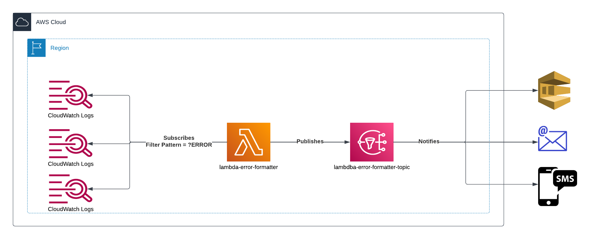

# lambda-error-reporter
The Lambda Error Reporter is a small tool which monitors cloudwatch logs and inform users should an error occur in one of their applications logging.
to cloudwatch. If an error were to occur the Lambda formats the stack trace or error before publishing the details to an SNS topic.

I created this as I'm often not monitoring the results of my Lambdas or other resources and wanted to know when they are experiencing issues.
The raw error log or stack trace was also not very readable, so I needed a Lambda to format it for easier readability.

## Diagram

## Current limitations
As the Lambda which is formatting the error before publishing to SNS is currently triggered by Cloudwatch logs, it is restricted to Cloudwatch logs within the same region as the Lambda. 

## Possible upgrades
The majority of my resources are running in Java. As such, I've written the code to pretty print Java Stack Traces.
However, I've recently been created resource in Javascript and Python, and have noticed that the stack traces are not as readable.
It would be to have a common method of pretty printing stack traces in multiple languages.
